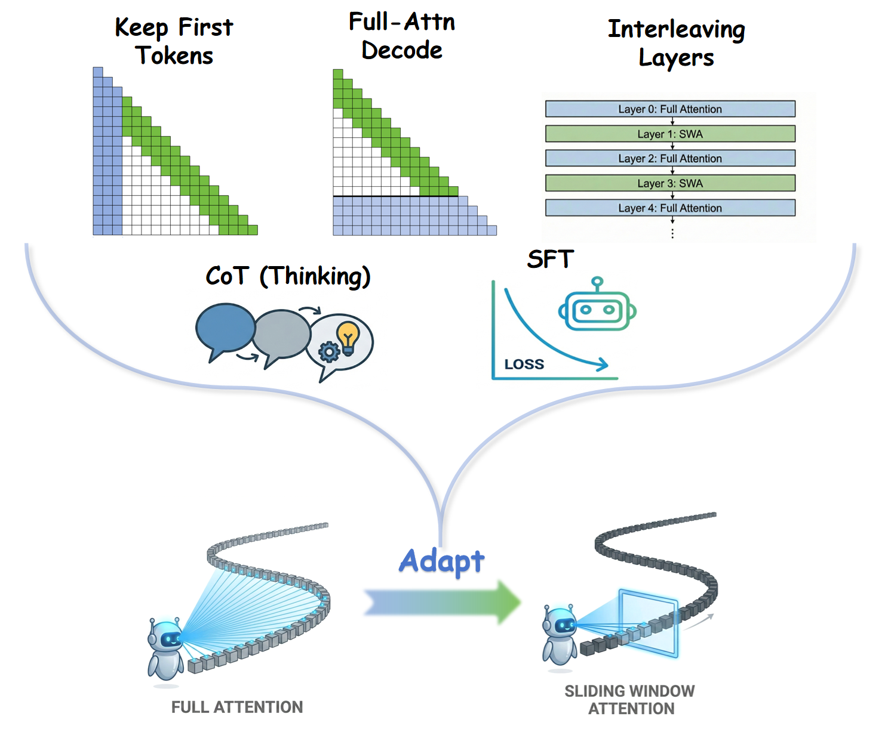

# Sliding Window Attention Adaptation
The code for paper ["Sliding Window Attention Adaptation"](https://arxiv.org/abs/2512.10411)



## 🛠️Installation
1. Make sure you have installed the requirements:
```
transformers >= 4.57.0
vllm >= 0.11.0,<0.12.0 (optional, if you want to use vLLM)
```

2. Install the **customized** flash-attention package:
```bash
git clone https://github.com/yuyijiong/flash-attention-SWAA
cd flash-attention-SWAA
bash install.sh
```
* CUDA >=12.8 is recommended.
* You need to compile from source code, so it may take some time.
* It will overwrite any existing flash-attn installation in your environment, so you'd better create a new python environment.
* Note that if nvcc compilation fails, you can try to set a smaller `MAX_JOBS` in `install.sh`, e.g., `export MAX_JOBS=4`.

3. This repository doesn't need to be installed as a package. Just clone it to your local machine and run (or import) the scripts directly.

## ⚙️Usage

### 🔮Core code
- The core code for SWAA is in the `swaa_patch` folder. It uses monkey patching to modify the attention mechanism of transformers and vLLM.

### 🤖Supported Models
- Currently we only support `Qwen3, Qwen2, Qwen3MoE, Llama` models

### 📝Sliding Window Attention Adaptation (SWAA) Config
To apply SWAA of a model, you must set SWAAConfig. SWAAConfig usually has 4 parameters to set:
- `sliding_window_size`: the size of the window size for sliding window attention. Default is `None`, which means using full attention.
- `keep_first`: the number of initial tokens to always keep in attention. Default is `0`, which means no tokens are always kept.
- `force_fa_decode`: whether to force the model to use full attention during decoding. Default is `False`.
- `non_sliding_layers`: the list of layer indices that do not use sliding window attention. Default is `[]`, which means all layers use sliding window attention.


### 🎞️Examples
<details>
<summary>1. To use transformers (HuggingFace) with SWAA:</summary>

```python
# make sure the "swaa_patch" folder is in your PYTHONPATH or sys.path, for example:
# import sys
# sys.path.append("./sliding-window-attention-adaptation")

# Then, before running your code, import the function hack_hf_swaa to patch transformers
from swaa_patch import SWAAConfig,hack_hf_swaa,hack_vllm_swaa
hack_hf_swaa(training=False)
...
# then you can load the model as usual
model = AutoModelForCausalLM.from_pretrained(model_path,
                                             device_map={"": device_id},
                                             dtype="bfloat16",
                                             trust_remote_code=True,
                                             attn_implementation="flash_attention_2",
                                             ).eval()
...
# finally, set your SWAA config and add it to the model's config,for example:
swaa_config = SWAAConfig(
    sliding_window_size=2048,
    keep_first=100,
    force_fa_decode=True,
    non_sliding_layers=[1,3,5,7,9,11],
)
model.config.swaa_config=swaa_config # attach SWAA config to model config. This is an informal temporary solution.
...
# now you can use the model as usual
prompt="Who are you?"
inputs = tokenizer([prompt], return_tensors="pt").to(device_id)
outputs = model.generate(**inputs)
```
</details>

<details>
<summary>2. To use vLLM offline inference with SWAA: </summary>

```python
# make sure the "swaa_patch" folder is in your PYTHONPATH or sys.path, for example:
# import sys
# sys.path.append("./sliding-window-attention-adaptation")

# Then, before running your code, import the function hack_vllm_swaa to patch transformers
from swaa_patch import SWAAConfig,hack_hf_swaa,hack_vllm_swaa
hack_vllm_swaa()
...
# then set your SWAA config
swaa_config = SWAAConfig(
    sliding_window_size=2048,
    keep_first=100,
    force_fa_decode=True,
    non_sliding_layers=[1,3,5,7,9,11],
)
...
# finally, initialize the LLM with the 'swaa_config' parameter, for example:
llm = LLM(model=model_path,
          dtype="float16",
          tensor_parallel_size=1,
          enforce_eager=True,  # for SWAA, we must enforce eager mode
          quantization=None,
          swaa_config=swaa_config,
)
...
# now you can use the model as usual
outputs = llm.generate(prompts=batch_prompts, sampling_params=sampling_params)
```
</details>

<details>
<summary>3. To use vLLM server with SWAA:</summary>

```bash
# cd into "swaa_patch" folder
cd ./sliding-window-attention-adaptation/swaa_patch

# start server with the customized serve_swaa.py
python serve_swaa.py \
    --tensor-parallel-size 1 \
    --port 5000 \
    --served-model-name qwen-4b-swaa \
    --model "YOUR_PATH/Qwen3-4B-Thinking-2507" \
    --max-model-len 50000 \
  # below are SWAA specific arguments
  --sliding-window-size 2048 \
  --keep-first 100 \
  --force-fa-decode True \
  --non-sliding-layers 1,3,5,7,9,11
  
# then you can send requests to the server as usual, for example, see ./Eval/test_vllm_server.py 
cd ../Eval
python test_vllm_server.py
```
</details>

## 📚Datasets
1. `./Datasets/fusang_long.parquet`: The training dataset for long-context SFT. [Download link](https://huggingface.co/datasets/yuyijiong/fusang-v1-filtered/)
2. `./Datasets/longmemeval_24k.parquet`: The benchmark dataset for evaluation. [Download link](https://huggingface.co/datasets/yuyijiong/LongMemEval_24k)
3. `./Datasets/longbenchv2_qa.parquet`: Another dataset for evaluation. [Download link](https://huggingface.co/datasets/yuyijiong/LongMemEval_24k)

## 📈Evaluation
1. To run evaluation, refer to `./Eval/eval_swaa.py`. You can modify the parameters or code in the "main" part of the script as needed.
2. It is recommended to write your model path and SWAA configurations in json files, like those in `./Eval/settings_list/`. Then let `./Eval/eval_swaa.py` read them.
3. Any dataset can be used for evaluation, but should have at least the 3 fields: 
   - `prompt`: the whole input prompt, including the long context and the task instruction.
   - `question`: the question or the task instruction only, which should be relatively short.
   - `answer`: the reference answer for evaluation, which should be relatively short.
4. The evaluation results will be saved as a json file in `./Eval/eval_output/`

## 🏋️Fine-tuning
1. `./SFT/self_distill_data.py` can be used to generate self-distillation data.
2. To run fine-tuning, refer to `./SFT/sft_swaa.py`, and set your `model_path, dataset_path, SWAAConfig` in the code of the `'__main__'` part of the script.
3. The fine-tuned models' LoRA weights in our experiments can be downloaded from [🤗HuggingFace](https://huggingface.co/yuyijiong/Qwen3-SWA-adaptation)

## ⏱️Efficiency Test
1. To run efficiency test on vllm, refer to `./Speed/time_test_vllm.sh`. 
The configuration of the input and output length is in `./Speed/bench_hparams.json`;
The configuration of the model and SWAAConfig is in `./Speed/serve_hparams.json`. You can modify other parameters in the script as needed.
2. `./Speed/parse_time_json.py` can collect the time test results and print them in markdown table format.
3. To run efficiency test on HF transformers, refer to `./Speed/speed_test_hf.py`. 

## 📊LightTransfer
1. To run the baseline method [LightTransfer](https://arxiv.org/abs/2410.13846), use `./LightTransfer/get_lazy_ratio.py`. 
Set your `model_path, dataset_path` in the code of the `'__main__'` part of the script.
2. This method doesn't show stable improvement in our experiments, so it needs to be further investigated.

## 📋To-do
- [ ] Use vllm plugin system (instead of monkey patching) to integrate SWAA more flexibly.
- [ ] Implement with Sglang
- [ ] Implement with FlashInfer
- [ ] Implement the memory release mechanism corresponding to KV cache discarding.
- [ ] More model support, e.g., Mistral, etc.